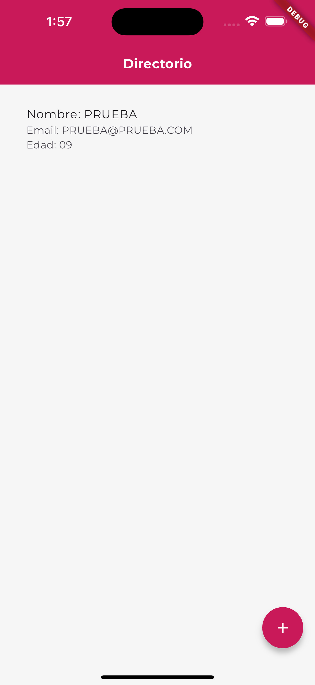
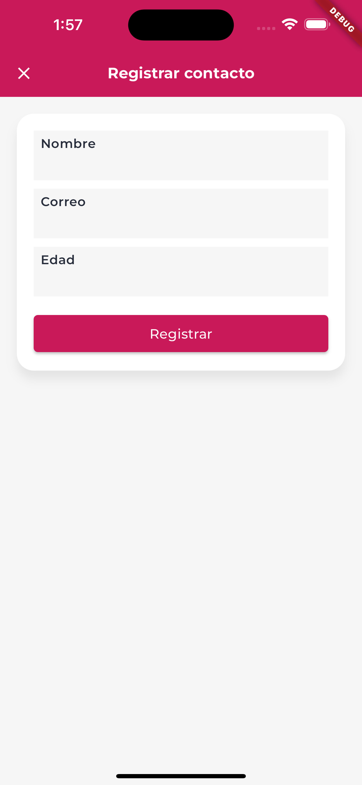
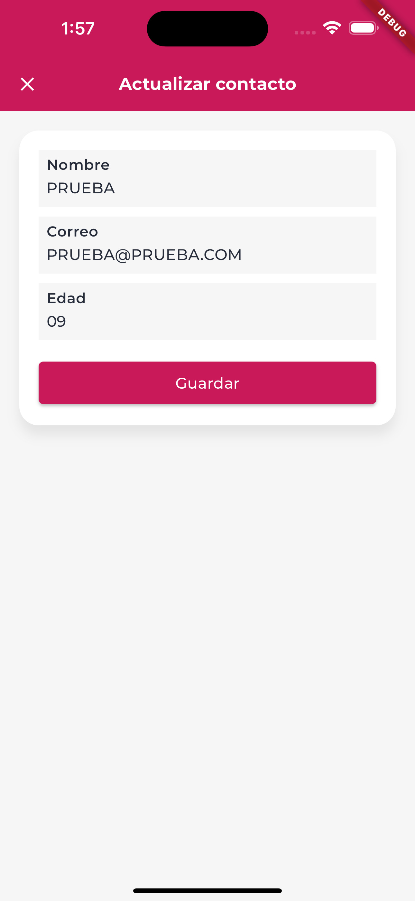
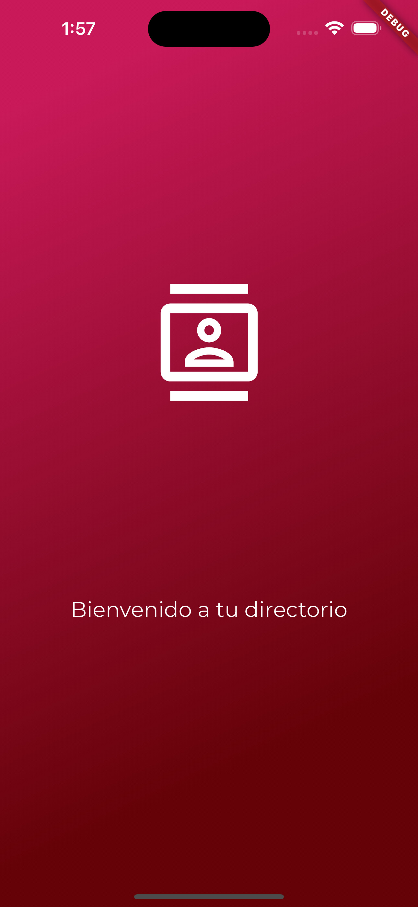

# DirectoryApp

A Flutter Directory app

## OS
1. Android
2. IOS

## Language Application Support
Spanish

## Framework and language
1. Flutter v- 3.3.2
2. Dart

## Libraries
1. get
2. DIO
3. sqflite
4. json_serializable

## API's

Entrar a la carpeta raiz 
/Directory/lib/core/manager/
posteriormente ejecutar la simulacion de server
json-server --watch db.json

### Get all contacts
``` javascript
fetch('http://localhost:3000/contacts')
            .then(res=>res.json())
            .then(json=>console.log(json))
```

### Get a single contact
``` javascript
fetch('http://localhost:3000/contacts/$id')
            .then(res=>res.json())
            .then(json=>console.log(json))
```

### Update contact
``` javascript
fetch('http://localhost:3000/contacts/$id')
            .then(res=>res.json())
            .then(json=>console.log(json))
```

### Delete contact
``` javascript
fetch('http://localhost:3000/contacts/$id')
            .then(res=>res.json())
            .then(json=>console.log(json))
```

## Authors
- [@IvanZeroi96](https://github.com/IvanZeroi96)

## Donate
[](https://www.paypal.com/paypalme/IvanZeroi)

## Boost
You can support me by doing "☆ Star" in the repo or push me to "GitHub Star".

[](https://stars.github.com/nominate/)

## Images




